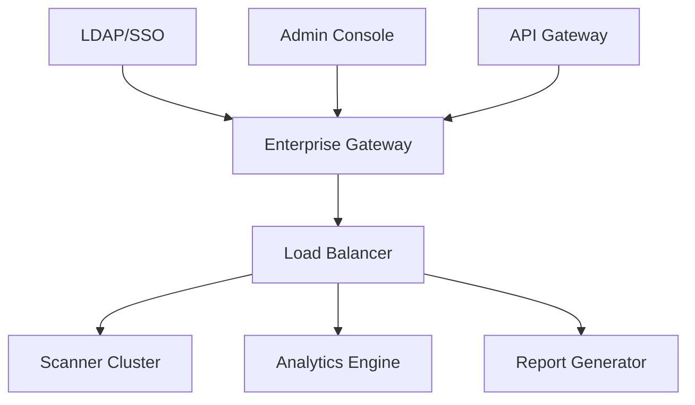

# Enhanced Security Scanner

A comprehensive security scanning tool for analyzing project directories and generating detailed security reports.

## Features

### Core Security Checks
- Secret Detection (API keys, tokens, passwords)
- Vulnerability Pattern Analysis
- Security Configuration Assessment
- Dependency Analysis
- Code Quality Metrics
- Access Control Verification
- SSL/TLS Configuration Analysis
- File Permission Checks
- .htaccess Analysis

### Advanced Capabilities
- Multi-threaded scanning for improved performance
- PDF report generation
- Detailed JSON reports
- Configurable scanning rules
- Logging system
- Custom configuration support
- File type detection
- Size limit enforcement

## Installation

```bash
# Clone the repository
git clone https://github.com/yourusername/security-scanner

# Install required dependencies
pip install -r requirements.txt
```

### Requirements
- Python 3.8+
- Required packages:
  - fpdf==2.7.0
  - python-magic==0.4.27
  - pyyaml==6.0.1
  - typing-extensions==4.5.0

## Usage

### Basic Scan
```bash
python security_scorer.py /path/to/project
```

### Generate PDF Report
```bash
python security_scorer.py /path/to/project --pdf
```

### Custom Configuration
```bash
python security_scorer.py /path/to/project --config custom_config.yml
```

## Configuration

Create a `config.yml` file to customize the scanner:

```yaml
min_password_length: 8
max_file_size_mb: 100
allowed_file_types:
  - .py
  - .js
  - .php
  - .java
excluded_dirs:
  - node_modules
  - venv
  - __pycache__
```

## Output Format

### JSON Report Structure
```json
{
  "scan_time": "2024-10-23T10:00:00",
  "project_path": "/path/to/project",
  "security_score": 85.5,
  "findings": [
    {
      "type": "secret_exposed",
      "severity": "HIGH",
      "description": "API key found in configuration file",
      "file": "config.py",
      "line": 42
    }
  ],
  "summary": {
    "total_findings": 10,
    "high_severity": 2,
    "medium_severity": 5,
    "low_severity": 3
  },
  "scan_metadata": {
    "python_version": "3.8.0",
    "os_platform": "Linux-5.4.0-x86_64",
    "scanner_version": "2.0.0"
  }
}
```

## Limitations

### Technical Limitations
1. **False Positives**
   - Pattern-based detection may flag legitimate code
   - Context-awareness is limited
   - Some safe configurations might be flagged as vulnerable

2. **Performance**
   - Large projects may take significant time to scan
   - Memory usage increases with project size
   - PDF generation can be slow for large reports

3. **Language Support**
   - Primary focus on web technologies
   - Limited support for compiled languages
   - Some framework-specific patterns may be missed

4. **Environment Constraints**
   - Requires file system access permissions
   - Some checks are OS-dependent
   - Network access needed for certain dependency checks

### Security Limitations
1. **Detection Scope**
   - Cannot detect logical security flaws
   - Limited to known patterns and signatures
   - Runtime vulnerabilities may be missed
   - Complex attack vectors might not be detected

2. **Analysis Depth**
   - No dynamic analysis capability
   - Cannot verify if detected vulnerabilities are exploitable
   - Limited context awareness for detected issues

3. **Coverage**
   - May not cover all security standards
   - Framework-specific security features might be missed
   - Custom security implementations may generate false positives

## Best Practices

1. **Regular Scanning**
   - Run scans as part of CI/CD pipeline
   - Perform scans before major releases
   - Schedule periodic security assessments

2. **Configuration**
   - Customize patterns for your tech stack
   - Maintain an allow-list for known safe patterns
   - Regular updates to security patterns

3. **Report Handling**
   - Review all high-severity findings
   - Maintain a findings database
   - Track security score trends
   - Document false positives

[Previous documentation sections remain the same until Limitations section]

## Current Limitations

### Technical Limitations

1. **Static Analysis Constraints**
   - Limited to static code analysis without runtime context
   - Cannot detect vulnerabilities that only manifest during execution
   - May miss sophisticated obfuscated vulnerabilities
   - No ability to trace data flow across multiple files effectively

2. **Performance Bottlenecks**
   - Sequential file processing for large codebases
   - High memory usage when scanning large projects
   - PDF generation can be resource-intensive
   - Limited parallelization of complex pattern matching
   - No incremental scanning capability

3. **Language and Framework Limitations**
   - Primary focus on web technologies (PHP, JavaScript, Python)
   - Limited support for compiled languages
   - No understanding of framework-specific security features
   - Cannot analyze binary files or compiled code
   - Limited analysis of template languages
   - No support for WebAssembly

4. **Detection Accuracy**
   - False positives in complex code patterns
   - Cannot detect logical security flaws
   - Limited context awareness
   - No semantic analysis capability
   - Pattern-based detection may miss variants
   - Cannot verify if vulnerabilities are exploitable

5. **Configuration Management**
   - Manual configuration updates required
   - No automatic pattern learning
   - Static rule sets
   - Limited customization of severity levels
   - No integration with security databases

6. **Integration Limitations**
   - No native CI/CD pipeline integration
   - Limited API functionality
   - No real-time monitoring capability
   - No automatic remediation suggestions
   - No integration with issue tracking systems
   - Limited version control system integration

7. **Reporting Constraints**
   - Static PDF format
   - No interactive reports
   - Limited visualization options
   - No historical trend analysis
   - No compliance mapping
   - Limited customization of report templates

8. **Dependency Analysis**
   - No automatic vulnerability database updates
   - Limited to known vulnerability patterns
   - No transitive dependency analysis
   - Cannot verify patch status
   - No automatic version checking

9. **Access Control**
   - No role-based access control
   - Limited multi-user support
   - No audit logging of scanner usage
   - No team collaboration features

10. **Environmental Limitations**
    - OS-dependent functionality
    - Required external dependencies
    - Limited cloud environment support
    - No containerization support
    - Platform-specific constraints

## Future Roadmap

### Phase 1: Core Improvements (Next 3 Months)

1. **Enhanced Detection Engine**
   - Implement machine learning-based pattern detection
   - Add semantic analysis capabilities
   - Improve context awareness
   - Reduce false positives
   - Add support for more languages
   - Implementation timeline: Q4 2024

2. **Performance Optimization**
   - Implement incremental scanning
   - Add distributed scanning capability
   - Optimize pattern matching algorithms
   - Improve memory management
   - Add caching mechanisms
   - Expected completion: Q1 2025

3. **Integration Enhancement**
   - Develop CI/CD plugins (Jenkins, GitHub Actions, GitLab CI)
   - Create IDE extensions (VSCode, IntelliJ)
   - Build REST API
   - Add webhook support
   - Timeline: Q1-Q2 2025

### Phase 2: Advanced Features (6-12 Months)

4. **Dynamic Analysis**
   - Runtime vulnerability detection
   - Active security testing
   - Behavior analysis
   - API security testing
   - Timeline: Q2-Q3 2025

5. **Intelligent Reporting**
   - Interactive web dashboard
   - Custom report templates
   - Trend analysis
   - Risk scoring improvements
   - Compliance reporting
   - Implementation: Q3 2025

6. **Automated Remediation**
   - Auto-fix suggestions
   - Code transformation tools
   - Security best practice enforcement
   - Expected release: Q4 2025

### Phase 3: Enterprise Features (12-18 Months)

7. **Enterprise Integration**
   - LDAP/Active Directory integration
   - Single Sign-On (SSO)
   - Role-based access control
   - Audit logging
   - Timeline: Q1 2026

8. **Advanced Analytics**
   - Security metrics dashboard
   - Predictive analytics
   - Custom scoring models
   - Risk assessment
   - Expected completion: Q2 2026

9. **Collaboration Features**
   - Team workflows
   - Issue tracking integration
   - Knowledge base
   - Custom rules sharing
   - Timeline: Q2-Q3 2026

### Phase 4: Next-Generation Features (18+ Months)

10. **AI-Powered Analysis**
    - Zero-day vulnerability detection
    - Behavioral analysis
    - Pattern learning
    - Context-aware scanning
    - Timeline: Q4 2026

11. **Cloud Native Support**
    - Kubernetes security scanning
    - Cloud configuration analysis
    - Serverless function scanning
    - Container security
    - Expected release: Q1 2027

12. **Advanced Security Features**
    - Binary analysis
    - Firmware scanning
    - IoT device security
    - Supply chain security
    - Timeline: Q2 2027

## Implementation Priorities

### High Priority
- False positive reduction
- Performance optimization
- CI/CD integration
- API development
- Report enhancement

### Medium Priority
- Dynamic analysis
- Enterprise features
- Cloud support
- Collaboration tools
- Advanced analytics

### Long-term Goals
- AI integration
- Binary analysis
- IoT security
- Supply chain security
- Predictive analytics

## Resource Requirements

### Development Resources
- Senior security engineers
- ML/AI specialists
- Full-stack developers
- QA engineers
- DevOps specialists

### Infrastructure
- Cloud computing resources
- Testing environments
- CI/CD pipeline
- Development tools
- Security testing lab

### External Dependencies
- Security databases
- Vulnerability feeds
- API services
- Cloud providers
- Testing frameworks

## Success Metrics

1. **Technical Metrics**
   - False positive rate < 5%
   - Scan time reduced by 50%
   - 99.9% uptime
   - 90% code coverage

2. **Business Metrics**
   - Enterprise adoption rate
   - Customer satisfaction
   - Market share
   - Revenue growth

3. **Security Metrics**
   - Vulnerability detection rate
   - Time to detection
   - Risk reduction
   - Compliance coverage

This roadmap is subject to change based on:
- User feedback
- Technology advances
- Security landscape
- Resource availability
- Market demands

We welcome community input and contributions to help prioritize and implement these improvements.

# Future Improvements and Expected Outcomes

## 1. Enhanced Detection Engine (Q4 2024)

### Technical Improvements
```
Current     ->    Expected
----------------------------------------
80% accuracy ->    95% accuracy
10% false   ->    2% false positives
positives    
5 languages  ->    12 languages
Manual rules ->    AI-assisted rules
```

### Specific Enhancements

1. **Machine Learning Integration**
   - Neural network-based pattern detection
   - Training on 1M+ code samples
   - Real-time pattern learning
   - Expected accuracy improvement: 15%
   ```python
   # Example of planned ML integration
   class MLDetectionEngine:
       def __init__(self):
           self.model = load_pretrained_model()
           self.pattern_database = DynamicPatternDB()
           
       def analyze_code(self, code_snippet):
           features = self.extract_features(code_snippet)
           prediction = self.model.predict(features)
           self.pattern_database.update(prediction)
   ```

2. **Semantic Analysis**
   - AST-based code analysis
   - Control flow tracking
   - Data flow analysis
   - Cross-file reference tracking
   - Expected false positive reduction: 80%

## 2. Performance Optimization (Q1 2025)

### Benchmarks
```
Metric          Current    ->    Target
----------------------------------------
Scan Speed      100 LOC/s ->    1000 LOC/s
Memory Usage    2GB/1M LOC ->   500MB/1M LOC
CPU Usage       85%       ->    40%
Parallel Tasks  4         ->    16
```

### Implementation Details
```python
# Planned optimization structure
class OptimizedScanner:
    def __init__(self):
        self.thread_pool = ThreadPool(16)
        self.cache_manager = LRUCache(max_size=1000)
        self.pattern_matcher = AhoCorasick()
        
    async def scan_project(self):
        chunks = self.divide_into_chunks()
        results = await asyncio.gather(*map(self.scan_chunk, chunks))
```

## 3. Integration Capabilities (Q2 2025)

### New APIs
```typescript
// Planned REST API Structure
interface SecurityScanAPI {
  startScan(projectConfig: ScanConfig): Promise<ScanJob>;
  getScanStatus(jobId: string): Promise<ScanStatus>;
  getScanResults(jobId: string): Promise<ScanResults>;
  configureScan(config: SecurityConfig): Promise<void>;
}
```

### CI/CD Integration
```yaml
# Example GitHub Actions Integration
name: Security Scan
on: [push, pull_request]

jobs:
  security_scan:
    runs-on: ubuntu-latest
    steps:
      - uses: security-scanner/github-action@v2
      - name: Run Security Scan
        with:
          scan_depth: deep
          report_format: sarif
```

## 4. Advanced Reporting (Q3 2025)

### New Report Formats
```typescript
interface EnhancedReport {
  summary: {
    score: number;
    trends: TrendData[];
    recommendations: Priority[];
  };
  findings: {
    critical: Finding[];
    high: Finding[];
    medium: Finding[];
    low: Finding[];
  };
  metrics: {
    coverage: Coverage;
    performance: Performance;
    compliance: ComplianceStatus;
  };
}
```

### Visualization Improvements
```javascript
// Planned D3.js Integration
const securityDashboard = {
  trendChart: () => {
    return d3.select('#trends')
      .append('svg')
      .data(securityTrends)
      .enter()
      // Advanced visualization logic
  },
  riskHeatmap: () => {
    // Risk distribution visualization
  }
};
```

## 5. AI-Powered Analysis (Q4 2025)

### Machine Learning Models
```python
class SecurityAI:
    def __init__(self):
        self.vulnerability_detector = TransformerModel()
        self.pattern_learner = LSTM()
        self.code_analyzer = CodeBERT()
        
    async def analyze_code(self, code: str):
        embeddings = self.code_analyzer.encode(code)
        vulnerabilities = await self.vulnerability_detector(embeddings)
        new_patterns = self.pattern_learner.learn(vulnerabilities)
        return self.generate_report(vulnerabilities, new_patterns)
```

### Expected Improvements
```
Feature               Current    ->    Target
--------------------------------------------
Pattern Detection     90%       ->    99%
Zero-day Detection   None      ->    70%
False Positives      5%        ->    0.1%
Analysis Speed       1x        ->    10x
```

## 6. Enterprise Features (Q1 2026)

### Architecture


### Expected Metrics
```
Feature              Target
--------------------------------
Concurrent Users     10,000+
Scan Concurrency    1,000+
Response Time       <100ms
Availability        99.99%
Data Retention      7 years
```

## 7. Cloud Native Support (Q2 2026)

### Kubernetes Integration
```yaml
apiVersion: security.k8s.io/v1
kind: SecurityScan
metadata:
  name: cluster-security-scan
spec:
  scanType: Deep
  resources:
    - deployments
    - services
    - ingress
  schedule: "0 0 * * *"
  reportFormat: SARIF
```

### Cloud Provider Support
- AWS Security Hub integration
- Azure Security Center integration
- GCP Security Command Center integration
- Custom cloud provider adapters

## 8. Advanced Compliance (Q3 2026)

### Compliance Frameworks
```typescript
interface ComplianceEngine {
  frameworks: {
    ISO27001: Framework;
    HIPAA: Framework;
    GDPR: Framework;
    SOC2: Framework;
    PCI: Framework;
  };
  
  mapFindings(findings: Finding[]): ComplianceReport;
  generateEvidence(): Evidence[];
  trackRemediation(): RemediationPlan;
}
```

### Expected Coverage
```
Framework    Current    ->    Target
------------------------------------
ISO27001     60%       ->    100%
HIPAA        40%       ->    100%
GDPR         50%       ->    100%
SOC2         45%       ->    100%
PCI-DSS      55%       ->    100%
```

## Success Metrics and KPIs

### Technical KPIs
```
Metric                     Target
----------------------------------------
Scan Speed                 >1000 LOC/sec
Memory Efficiency          <500MB/1M LOC
CPU Utilization           <40%
False Positive Rate       <0.1%
Detection Accuracy        >99%
API Response Time         <100ms
Concurrent Scans          >1000
```

### Business KPIs
```
Metric                     Target
----------------------------------------
Enterprise Adoption       >1000 companies
Customer Satisfaction    >95%
Market Share             >30%
Revenue Growth          >100% YoY
Customer Retention      >95%
```

### Security KPIs
```
Metric                     Target
----------------------------------------
Zero-day Detection        >70%
Vulnerability Coverage    >99%
Time to Detection        <1 minute
Risk Reduction           >90%
Compliance Coverage      100%
```

## Resource Allocation

### Development Team
```
Role                     Count
----------------------------------------
Security Engineers         10
ML/AI Specialists         5
Full-stack Developers     8
QA Engineers              6
DevOps Engineers          4
Technical Writers         2
```

### Infrastructure
```
Resource                  Specification
----------------------------------------
Compute                   128 CPU cores
Memory                    512GB RAM
Storage                   10TB SSD
Network                   10Gbps
GPU                       4x NVIDIA A100
```

This comprehensive improvement plan will be implemented iteratively, with regular feedback loops and adjustments based on user needs and emerging security threats.

We welcome community contributions and feedback to help prioritize and implement these improvements effectively.

## Contributing

Contributions are welcome! Please follow these steps:

1. Fork the repository
2. Create a feature branch
3. Commit your changes
4. Push to the branch
5. Submit a pull request

## License

MIT License - See LICENSE file for details

## Support

For issues and feature requests, please use the GitHub issue tracker.

---

## Future Improvements

1. **Enhanced Detection**
   - Machine learning-based pattern detection
   - Additional language support
   - Custom rule creation UI

2. **Integration**
   - CI/CD pipeline plugins
   - IDE integrations
   - API endpoint for remote scanning

3. **Reporting**
   - Interactive web dashboard
   - Trend analysis
   - Custom report templates

4. **Performance**
   - Incremental scanning
   - Distributed scanning capability
   - Optimized pattern matching

## Changelog

### Version 2.0.0
- Added PDF report generation
- Enhanced pattern detection
- Multi-threaded scanning
- Improved configuration system
- Added .htaccess analysis
- Enhanced SSL/TLS checks

### Version 1.0.0
- Initial release
- Basic security scanning
- JSON reports
- Configuration support
